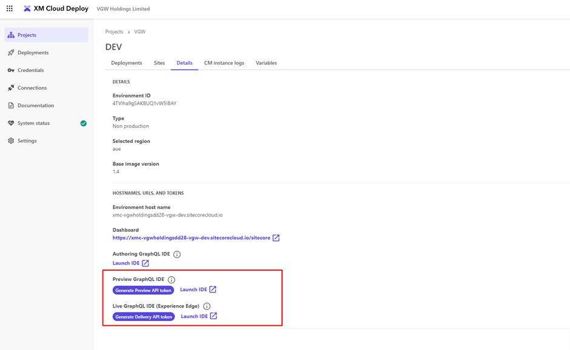

# mar-sitecore

Marketing SiteCore CMS for our home pages and landing pages

## Setting up Sitecore

### Required Installations

- [Install .Net 6.0](https://dotnet.microsoft.com/en-us/download/dotnet/6.0). At the time of writing, SDK 6.0.419 Arm64 is recommended.
- Sitecore CLI installed - this is available in the mar-sitecore repo. Navigate to the repository in terminal and run `dotnet tool restore` to install Sitecore CLI.

### Sign In

Sign in to Sitecore cloud using the terminal by running `dotnet Sitecore cloud login`. After successful login, run `dotnet sitecore cloud organization info` to check the configuration is correct. The below should be reflected:

```
   Id        : org_4B4AZgSu4pvM4TVQ
   Name      : vgw-holdings-limited-1
   Region    : aue
   CreatedAt : 23/6/2023 2:28:40 pm
   CreatedBy : SaaS Automation Toolset
   Tier      : Standard
```

## Local Machine set up

To run the Next.js environment on your local machine, ensure you have the required installations (listed above), then follow the below steps:

1. In terminal, navigate to `/src/global-poker-academy` and run `npm i`
2. Navigate to the [Dev environment deployment on Sitecore XM Cloud Deploy](https://deploy.sitecorecloud.io/project/CzvGP1EC5vUYojF6C2eVs/environment/4TVlha9gSAKBUQ1vW5IBAY/deployments?organization=org_4B4AZgSu4pvM4TVQ) and click the **Details** tab.
3. Locate the GraphQL API tokens:



4. Click on _Generate Live API token_ under **Live GraphQL IDE (Experience Edge)**, and copy the token.
5. Add this token to the variable `SITECORE_API_KEY` in the `/src/global-poker-academy/.env` file
6. In terminal, navigate to `/src/global-poker-academy` and run one of the scripts below corresponding to the desired site:

- Global Poker: `npm run local:global-poker`
- Global Poker Academy: `npm run local:global-poker-academy`
- Shareholders: `npm run local:shareholders`

7. Build should start automatically and be available at localhost:3000 in the browser.

## Building sites using static export

1. Go to the src\global-poker-academy folder
2. Configure the following env variables

| Variable          | Value                                        | Description                                                  |
| ----------------- | -------------------------------------------- | ------------------------------------------------------------ |
| EXPORT_MODE       | 1                                            | Turns export mode on. Not necessary for XM Cloud deployment. |
| SITECORE_API_KEY  | `<secret from the Sitecore Cloud Portal>`    | API Key for fetching content from Experience Edge.           |
| GRAPH_QL_ENDPOINT | https://edge.sitecorecloud.io/api/graphql/v1 | Sitecore Experience Edge Endpoint.                           |

3. Run the following commands in terminal

   ```ps1
   npm i
   npm run build
   ```

4. The static export can be found in the **out** folder

## Serialisation

### "Validate"/"Fix" based off current module configuration

> Only serialise the site module you are interested in, e.g. `VGW.ChumbaCasino"`

```
dotnet sitecore ser validate --include "VGW.ChumbaCasino"  --fix
```

### "Update" based off current module configuration

> Only serialise the site module you are interested in, as per the below:

- Chumba Casino: `npm run pull-serialisation:chumba-casino`
- Global Poker: `npm run pull-serialisation:global-poker`
- Global Poker Academy: `npm run pull-serialisation:global-poker-academy`
- Shareholders: `npm run pull-serialisation:shareholders`
- Global shared components: `npm run pull-serialisation:shared`
